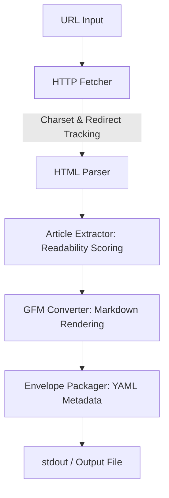

# 🦀 mdget — Agent-First HTTP Client

[](LICENSE)
[-orange.svg)](https://www.rust-lang.org)
[]()
[](CONTRIBUTING.md)

> 🚀 An agent-first command-line utility and library that fetches web pages and extracts clean, structured, noise-free Markdown. Perfect for LLM prompts, RAG pipelines, and automated agent workflows.

---

## 📖 Table of Contents

- [🦀 mdget — Agent-First HTTP Client](#-mdget--agent-first-http-client)
  - [📖 Table of Contents](#-table-of-contents)
  - [🔍 Overview](#-overview)
  - [🏗️ Architecture](#️-architecture)
  - [✨ Features](#-features)
  - [📦 Installation](#-installation)
    - [From Source](#from-source)
  - [🚀 CLI Usage](#-cli-usage)
    - [Basic Fetch](#basic-fetch)
    - [Save Output to File](#save-output-to-file)
    - [Custom Options](#custom-options)
    - [Shell Completions](#shell-completions)
  - [📝 Configuration](#-configuration)
    - [Example `config.toml`](#example-configtoml)
  - [✉️ Output Format](#️-output-format)
    - [Success Envelope Example](#success-envelope-example)
    - [Error Envelope Example](#error-envelope-example)
  - [🗺️ Roadmap](#️-roadmap)
  - [🛠️ Development](#️-development)
    - [Setup](#setup)
    - [Run Tests](#run-tests)
    - [Formatting and Linting](#formatting-and-linting)
  - [🤝 Contributing](#-contributing)
  - [📄 License](#-license)

---

## 🔍 Overview

When AI agents or LLMs browse the web, they are often overwhelmed by cookie banners, navigation menus, ads, tracker scripts, and complex layouts. **mdget** solves this by acting as a modern, agent-friendly replacement for `curl` or `wget`.

It doesn't just download raw HTML; it **extracts the main article content** (using a sophisticated scoring algorithm similar to Readability.js), **converts the DOM into clean Markdown**, **resolves all relative paths to absolute URLs**, and wraps the result in a **predictable YAML metadata frontmatter envelope**.

---

## 🏗️ Architecture



---

## ✨ Features

- 🔌 **Agent-Safe Fetching**: Automatically detects charsets from HTTP headers or HTML meta tags, handles decompression, and respects client-side timeouts.
- 🎯 **Noise Reduction**: Intelligently scores HTML nodes to remove headers, footers, sidebars, advertisements, and navigation links.
- 📉 **Token Reduction & Optimization**: Shrink content sizes for LLMs dynamically via compact mode (summarizing paragraphs to the first sentence, stripping code blocks) or hard word-count limits.
- 🔗 **Absolute URL Resolution**: Rewrites all relative links (`<a href="...">`) and images (``) into absolute URLs using the document base URL, ensuring agents can follow links or fetch assets.
- 📨 **Multiple Output Formats**: Choose between the default YAML frontmatter + markdown envelope, markdown-only (`--no-frontmatter`), or a single structured JSON object (`--json`) for direct API ingestion.
- 🎛️ **Request Customization**: Send custom headers (`-H/--header`), cookies (`--cookie`), or bearer tokens (`--bearer`) to authenticate or match browser behaviors.
- 📁 **Rich Content Support**: Automatically parses, converts, and formats HTML, JSON, XML/RSS/Atom feeds, plain text, and PDF files into structured Markdown.
- 📊 **Table to GFM Conversion**: Converts standard HTML tables into clean GitHub Flavored Markdown (GFM) tables.
- 📦 **YAML Frontmatter**: Wraps success and failure responses in a consistent YAML envelope to give agents structured access to response headers, redirect chains, and page metadata.
- 🔧 **Layered Configuration**: Integrates defaults, TOML files (`config.toml`), environment variables, and CLI overrides seamlessly.

---

## 📦 Installation

Ensure you have Rust and Cargo installed (edition 2024, Rust 1.85+ recommended).

### From Source

```bash
git clone https://github.com/hiranp/mdget.git
cd mdget
cargo install --path .
```

---

## 🚀 CLI Usage

### Basic Fetch

Fetch any web page and print the parsed Markdown with its YAML frontmatter to `stdout`:

```bash
mdget fetch https://example.com
```

### Save Output to File

Use the `-o` or `--output` flag to save the output directly to a file:

```bash
mdget fetch https://example.com -o article.md
```

### Custom Options

You can override defaults with CLI arguments:

```bash
mdget fetch https://example.com \
  --timeout 15 \
  --max-redirects 3 \
  --user-agent "MyAgent/1.0"
```

### Request Customization

Customize outgoing HTTP requests using headers, cookies, and bearer tokens:

```bash
# Add custom headers
mdget fetch https://example.com -H "X-Custom-Header: value" -H "Accept: text/plain"

# Add custom cookies
mdget fetch https://example.com --cookie "session=xyz123" --cookie "theme=dark"

# Authenticate with a Bearer Token (overrides any manual Authorization header)
mdget fetch https://example.com --bearer "your-jwt-token"
```

### Output Mode Selection

Control the format of the output returned by `mdget`. By default, `mdget` prepends a YAML metadata frontmatter. You can alter this behavior with the following mutually exclusive flags:

- `--no-frontmatter`: Discard the YAML envelope and output raw Markdown body only.
- `--json`: Output a single formatted JSON object containing all metadata envelope keys and the markdown body under the `markdown` key.

Example:

```bash
# Get raw markdown body only
mdget fetch https://example.com --no-frontmatter

# Get output wrapped in a JSON envelope
mdget fetch https://example.com --json
```

### Token Reduction (LLM Optimization)

Reduce the size of the retrieved page content for LLM contexts, RAG pipelines, or agents using the following parameters:

- `--compact`: Strips out code blocks and summarizes each paragraph down to its first sentence/excerpt.
- `--max-body-words <WORDS>`: Caps the output body word count to a maximum value, truncating any trailing content.

Example:

```bash
mdget fetch https://example.com --compact --max-body-words 100
```

### Shell Completions

Generate shell completions dynamically:

```bash
# For zsh
mdget completion zsh > ~/.zsh/completions/_mdget

# For bash
mdget completion bash > ~/.bash_completion.d/mdget
```

---

## 📝 Configuration

`mdget` uses a layered configuration system, loading settings in the following order (lowest to highest priority):

1. **Default Values** (e.g., info logging, default agent-safe HTTP settings).
2. **System-wide configuration file**: `/etc/mdget/config.toml`
3. **User configuration file**: `~/.config/mdget/config.toml` (or platform equivalent, e.g. `~/Library/Application Support/mdget/config.toml` on macOS).
4. **Environment variables**: Prefixed with `MDGET_` (e.g., `MDGET_LOG_LEVEL=debug`).
5. **Command-line arguments** (e.g., `--log-level debug`).

### Example `config.toml`

```toml
[log]
level = "info"

[log.file]
enabled = false
path = "~/.cache/mdget/mdget.log"
level = "info"
```

---

## ✉️ Output Format

`mdget` returns a standard envelope structure separated by standard YAML markers (`---`).

### Success Envelope Example

```yaml
---
success: true
url: https://example.com/
status: 200
title: Example Domain
description: This is a description of the example domain.
canonical_url: https://example.com/canonical
word_count: 19
body_word_count: 19
render_mode: full
body_word_limit: null
body_truncated: false
fetched_at: '2026-05-22T00:34:41.071405Z'
redirect_chain:
- https://example.com/
---

# Example Domain

This domain is for use in documentation examples without needing permission. Avoid use in operations.

[Learn more](https://iana.org/domains/example)
```

### Error Envelope Example

If a request fails (e.g., 404, network timeout, DNS failure), `mdget` outputs an error envelope with status code 0 and exits gracefully with a structured error log.

```yaml
---
success: false
url: https://httpbin.org/status/404
status: 404
error: http_404
message: 'HTTP 404: Not Found'
fetched_at: '2026-05-22T00:34:50.143208Z'
---
```

### JSON Envelope Example

When the `--json` flag is provided, the output is formatted as a single JSON object:

```json
{
  "success": true,
  "url": "https://example.com/",
  "status": 200,
  "title": "Example Domain",
  "description": "This is a description of the example domain.",
  "canonical_url": "https://example.com/canonical",
  "word_count": 19,
  "body_word_count": 19,
  "render_mode": "full",
  "body_word_limit": null,
  "body_truncated": false,
  "fetched_at": "2026-05-22T00:34:41.071405Z",
  "redirect_chain": [
    "https://example.com/"
  ],
  "markdown": "# Example Domain\n\nThis domain is for use in documentation examples without needing permission. Avoid use in operations.\n\n[Learn more](https://iana.org/domains/example)"
}
```

---

## 🗺️ Roadmap

- **Phase 1: HTTP Core & Extraction** (Completed ✅)
- **Phase 2: Content Types & Output Modes** (Completed ✅)
- **Phase 3: Caching & Resources** (Planned)
- **Phase 4: Authentication & Filtering** (Planned)

---

## 🛠️ Development

### Setup

```bash
git clone https://github.com/hiranp/mdget.git
cd mdget
```

### Run Tests

Verify code changes and run integration tests:

```bash
cargo test
```

### Formatting and Linting

Keep the code clean and idiomatic:

```bash
# Format code
cargo fmt --all

# Run linter
cargo clippy --all-targets --all-features -- -D warnings
```

---

## 🤝 Contributing

Contributions are highly appreciated! Please see [CONTRIBUTING.md](CONTRIBUTING.md) for environment setup instructions, style guides, and PR workflows.

By participating in this project, you agree to abide by the Contributor Covenant [CODE_OF_CONDUCT.md](CODE_OF_CONDUCT.md).

---

## 📄 License

This project is licensed under the MIT License. See the [LICENSE](LICENSE) file for details.

---

🙏 Acknowledgments
Built with ❤️ using the amazing Rust ecosystem
Inspired by modern CLI best practices
Thanks to all the crate maintainers for their excellent work
